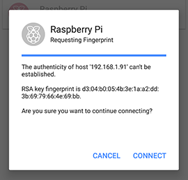

## Connect to a host
Make sure you are on the ‘Hosts’ screen. Tap the menu button in the top-left corner, then tap hosts.

Tap the host you wish to connect with once.You may see a [security warning](http://www.lysium.de/blog/index.php?/archives/186-How-to-get-ssh-server-fingerprint-information.html). Don’t worry: everything is fine. Hit `Connect`. You’ll only see this warning the first time Serverauditor connects to a host that it hasn’t seen before.

Now a terminal with a prompt should appear, you are connected. Type exit to close the terminal window.

> __!__ You can type `exit` to close the terminal window.

 

> ### Troubleshooting
> If a dialogue saying `Connection failed Connecting to xxx.xxx.xxx.xxx port 22` appears, it is likely you have entered an incorrect IP address. Otherwise, you device might not be hooked up to a network, the host might be turned off, or it may be in a different network than your device.
