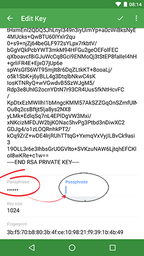

## I've generated a key with a passphrase, but the passphrase is not requested on connection

Serverauditor supports RSA, DSA, and ECDSA keys for passwordless login. And you may protect your private key using a passphrase. This means that the private key will be encrypted using a passphrase to add an aditional layer of security.

Passphrase protected keys can be [generated](../../features/keychain.md#generate-a-key) with the key generator which you can find under `Key chain > Add > Generate key`. When you generate a passphrase protected key set, the public key, encrypted private key, **and passphrase** will be stored in the Key chain. Because of this the passphrase will not be requested on the establishment of a connection. In case you wish that the passprhase will be prompted, simply remove the passphrase after keygeneration.

To do so:
* Tap the specific key 
* A new screen `Edit Key` should popup
* Tap the `Passphrase` field and remove its value
* And hit the tick `✓` in the top right corner

Now the passphrase will be prompted before a connection may be established.

> ***!*** Note that you also may [import](../../features/keychain.md#import-keys) passphrase protected keys. You only need to fill out the passphrase field if you wish to store the passphrase in Key chain