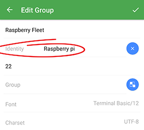

## Keychain

Keys and identities are easily managed using Keychain.

###In this document
* [Identities](#identities)
* [Key management](#key-management)
	* [Import keys](#import-keys)
		* [Paste a key](#paste-a-key)
		* [Import a key](#import-a-key)
	* [Generate a key](#generate-a-key)
	* [Export keys](#export-keys)
		* [Export to a host](#export-to-a-host)
		* [Export to a file](#export-to-a-file)
		* [Send by email](#send-by-email)

### Identities
An identity is a predefined username in combination with a password or key. An identity then can by applied among multiple hosts and host groups and it may be updated at any time. 

#### Add a new identity
To add a new identity
* Tap the blue `+`
* Then tap New Identity
* A new screen titled `New Identity` appears
* Fill out the `Name`, `Username`, and `password`, or `key`
* And hit the tick `✓` in the top right corner 

#### Edit or delete an existing identity
Existing identities can be modified. **To edit** an identity __single tap__ the identity, a new screen `Edit Identity` should appear. An identity is **deleted** with a long press, a dustbin  should appear in the top right corner, hit it!

#### Apply an identity
In the `New host`, `New group`, `Edit host`, and `Edit group` screens; Identities are applied to hosts and host groups, by tapping the blue icon  on the right to the `Username` field. A new screen named `Select identity` will appear. Tap the identity you wish to use. You'll be sent back to the previous screen.

> ***!*** Identities **are applicable to hosts and host groups**. One identity can be applied to multiple hosts and host groups at the time. An applied identity is editable in the Keychain making it easy to manage credentials of a (great) number of hosts.

### Key management
Use keys to enable secure password-less login. With key chain you can manage, organize and generate keys. Keys are managed similarely as [Hosts](hosts.md), [Groups](groups.md), and [Identities](#identities) are.

To add a key the blue `+`, to edit, [export](#export-keys) or remove an existing key, tap and hold it with a long press. 
Continue reading for a detailed description.

> ***!*** Keys in the keychain, imported and generated, may be[exported to a host](#export-to-a-host).

#### Import keys
##### Paste a key
Adding a key to the Key chain can be done in several ways. One of them is by pasting an existing key into the app. To do so
* Tap the blue `+`
* Then tap `Paste key`
* A new screen titled `Paste Key` appears
* Fill out the `Name`, and copy and paste the `Public key` and `Private key` into the fields
* You also may fill out a `Passphrase` if applicable
* And hit the tick `✓` in the top right corner

> ***!*** A passphrase encrypts the private key creating an extra security layer. A passphrase is optional and set using `$ ssh-keygen -p`

##### Import a key
Importing a key is another way to add a key to the Key chain. To import
existing key into the app. To do so
* Tap the blue `+`
* Then tap `Import key`
* Select the method you prefer
	* `Use the File manager`
	* `Search on SD Card`

> ***!*** File formats 

### Generate a key
You may use Key chain as key generator.
* Tap the blue `+`
* Then tap `Generate key`
* Now fill out the fields `Name`, `Type`, `Key size`
* `Passphrase` is optional and **will be stored in Key chain by default**

> ***!*** The Passphrase is stored in Key chain by default. Upon the esablishment of a connection the passphrase is not prompted. To change this, edit the key by removing the passphrase

### Export keys
Keys that are kept in Termius's Key chain are easily exported

#### Export to a host
`Export to a host` is a powerful feature that helps you to establish a key on a host automatically. 

#### Export to a file
#### Send by email
