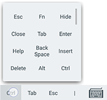

## The terminal

After connecting to a host, the terminal will pop up. 

### In this document
* [Terminal touch](#terminal-touch)

### Terminal touch
`Terminal touch` changes the way you interact with the terminal, it is activated by tapping the `Gesture toggle` . When Terminal touch toggled on, swipe gestures represent different terminal functions. Toggle Terminal touch off to use swipe gestures for browsing and scrolling.

#### Terminal touch toggled on
* Swipe with *one finger* to simulate the arrow keys
* Swipe with *two fingers* to simulate *Pg Up*, *Pg Dn*, *Home*, *End*
* Double tap to produce *Tab*
* Long press to Copy or Paste

#### Terminal touch toggled off
* **Swipe up or down** to scroll through a session 
* **Swipe to the left or the right** to hop between the active terminal tabs ([Premium only](../../general/subscriptions.md))

> ***!*** Hold any key on the additional keyboard to toggle the keyboard customization panel  
> 
