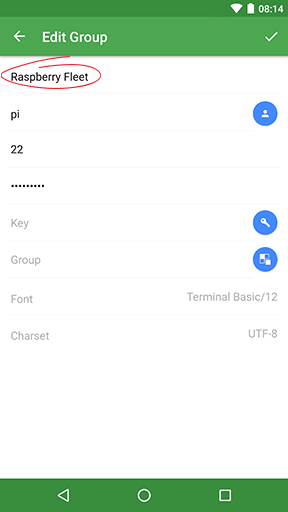
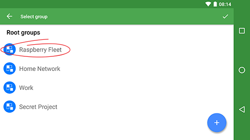

## Work with host groups

A clever way to manage multiple hosts is through host `Groups`. With these `Groups` you can collect similar hosts, and manage shared settings in a single action. In our example, we'll be setting up a Raspberry pi fleet in our local network.

### In this document
* [Create a host group](#create-a-host-group)
* [Add hosts to a group](#add-hosts-to-a-group)
* [Manage groups](#manage-groups)

## Create a host group
Make sure you are in the `Hosts` screen. 

To add a host group
* Hit the big blue `+` on the bottom right of the screen. 
* Now tap `New Group`

A screen titled `New Group` appears. It is very similar to the `New Host` screen. Here we will fill out the data that our hosts inside the group will have in common. Leave host-specific fields blank.

* Start with the group name; 'Raspberry Fleet' for instance
* Enter the username, password, port (22)
* You may set up a parent group and key
* And hit the tick `✓` in the top right corner 

> ***!*** Group settings correspond to individual settings of subordinate hosts. When a group setting is changed host settings are automatically changed as well. Note, however, that individual settings overrule group settings

## Add hosts to a group

There are two ways to add a host to a group. You may decide to add a host directly to a group, or change the group field inside the host's configuration.

To **add a host directly** to a group, navigate to the group and follow the same procedure as when [adding a basic host](basic_host.md). Notice that the `Group` field is already filled out with the name of the group you have navigated to.

To add a host to a group by **changing its** `Group` **field value**, 
* add a host using the blue `+`
* Before entering any details, tap the `Group` field
* Navigate to the correct group, 'Raspberry Fleet' in our case
* And hit the tick `✓` in the top right corner

You will notice that several fields now are filled out automatically. Continue like you would when [adding a basic host](basic_host.md).

## Manage groups

Groups can be organized in subgroups. Subordinate groups addopt the settings of the primary group. Note, however, that individual group settings overrule primary group settings.

A group can be edited and one or more selected groups can be removed with a long press.

> ***!*** Note that when deleting a group, all subordinate groups and hosts will be deleted as well!